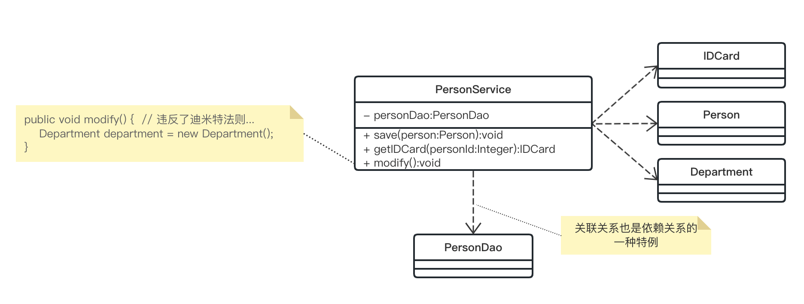
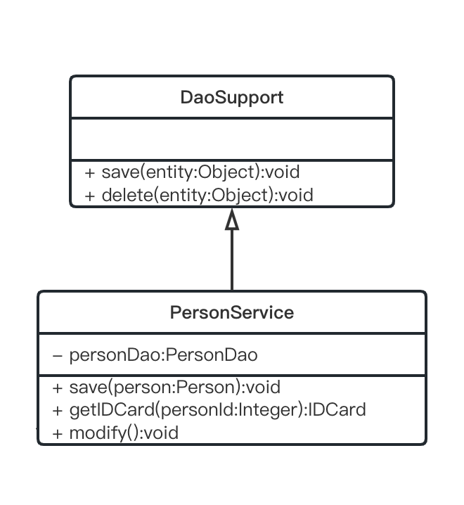
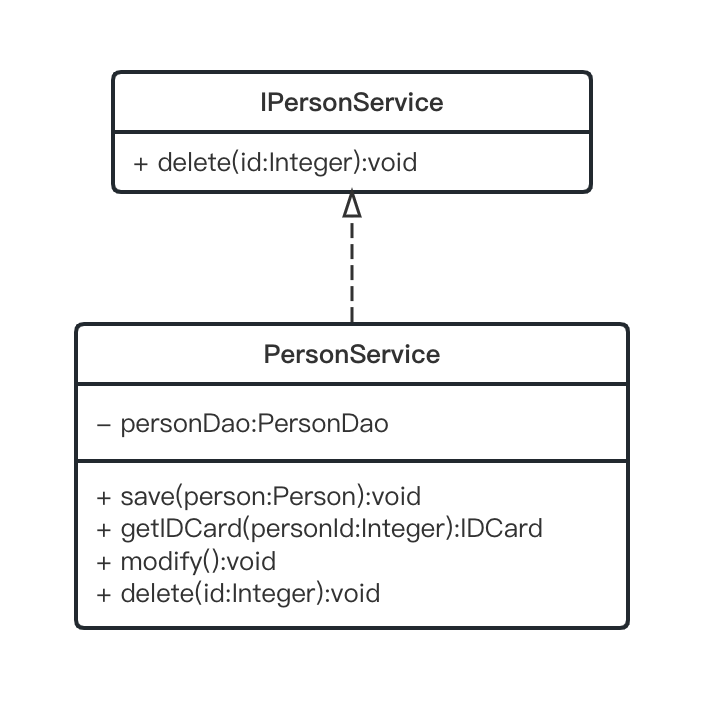
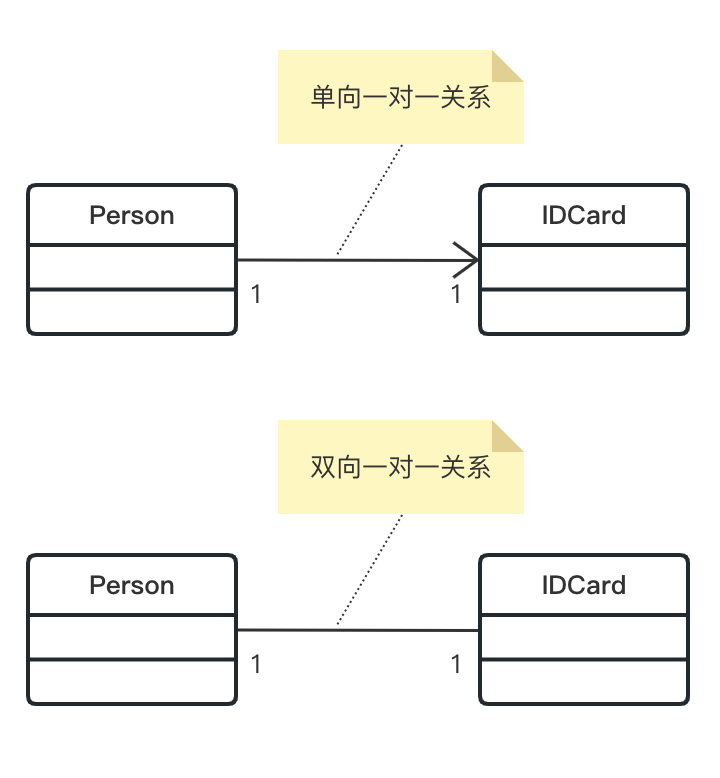
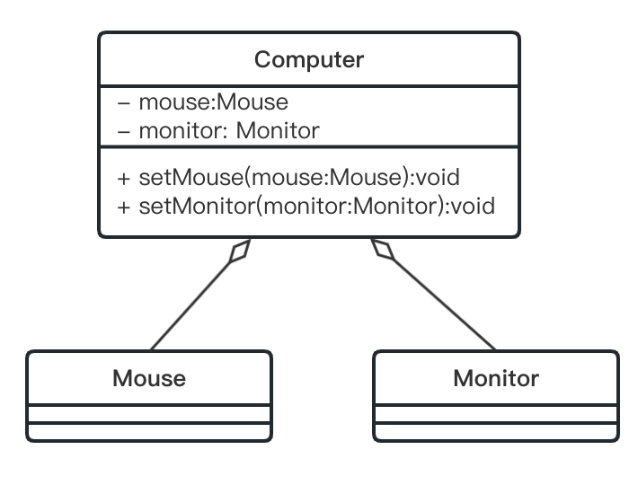
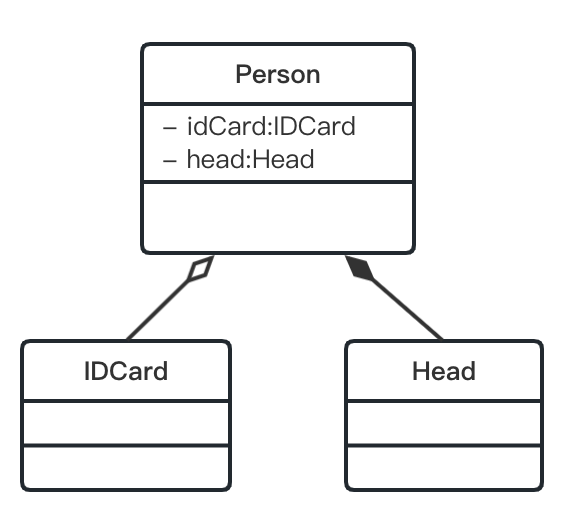

# UML 类图

UML (Unified Modeling Language) 统一建模语言，是一种用于软件系统分析和设计的语言工具，它用于帮助软件开发人员进行思考和记录思路的结果。

UML 本身是一套符号规定，这些符号用于描述模型中的各个元素和它们之间的关系。比如类、接口、实现、泛化（继承）、依赖、组合、聚合等。在网上找到一张图可以解释 UML 中的六种关系：


注：
1. Driver 到 Human 应该属于继承关系；
2. 聚合关系是整体和部分的关系，整体和部分可以分开；
3. 组合关系也是整体和部分的关系，但是整体和部分不能分开；

**UML 图的分类：**

1. 用例图
2. 静态结构图：类图、对象图、包图、组件图、部署图
3. 动态行为图：交互图（时序图与协作图）、状态图、活动图

这里主要介绍 UML 类图，类图用于描述类本身的组成和类之间的各种静态关系，是 UML 图中最核心的。

# 依赖（Dependence）

只要在类中用到了另一个类，那么它们之间就存在依赖关系。

<i>Example:</i>

```java
public class PersonService {
    private PersonDao personDao;
    public void save(Person person) {}
    public IDCard getIDCard(Integer personId) {}
    public void modify() {
        Department department = new Department();
    }
}
```



小结：
依赖关系即类中用到了另一个类，可以是
1. 类的成员属性
2. 方法的返回类型
3. 方法接收的参数类型
4. 方法中使用到的变量类型

# 泛化（Generalization）

泛化关系实际上就是继承关系，它是依赖关系的特例。

<i>Example:</i>

```java
public abstract class DaoSupport {
    public void save(Object entity) {}
    public void delete(Object entity) {}
}

public class PersonService extends DaoSupport {
    //...
}
```



# 实现（Implementation）

实现关系也是依赖关系的特例。

<i>Example:</i>

```java
public interface IPersonService {
    public void delete(Integer id);
}

public class PersonService implements IPersonService {
    //...
    public void delete(Integer id) {}
}
```



# 关联（association）

关联关系表示类与类之间的联系，也是依赖关系的特例。
- 关联关系具有导航性：即双向关系或单向关系。
- 关联关系具有多重性：如“1”（表示有且仅有1个），“0...”（表示0个或者多个），“0,1”（表示0个或者1个），“n...m”（表示n到m个都可以），“m...”（表示至少m个）。

<i>Example:</i>

```java
// 单向一对一关系
public class Person {
    private IDCard idCard;
}
public class IDCard {}

// 双向一对一关系
public class Person {
    private IDCard idCard;
}
public class IDCard {
    private Person person;
}
```



# 聚合（Aggregation）

聚合关系表示的是整体和部分的关系，整体与部分可以分开。聚合关系是关联关系的特例，所以它具有关联关系的导航性与多重性。

例如：一台电脑由键盘、显示器、鼠标等组成；组成电脑的各个配件是可以从电脑上分离出来的。

<i>Example:</i>

```java
public class Computer {
    private Mouse mouse;
    private Monitor monitor;
    // setters
}
public class Mouse {}
public class Monitor {}
```



# 组合（Composition）

组合关系也是整体与部分的关系，但是整体与部分不可以分开。组合关系也是关联关系的特例。

例如：Head 与 Person 是组合关系，IDCard 与 Person 是聚合关系。

<i>Example:</i>

```java
public class Person {
    private IDCard idCard;
    private Head head = new Head();
    // setters
}
public class IDCard {}
public class Head {}
```



但是，如果程序在 Person 实体中定义了对 IDCard 的级联删除，即删除 Person 时连同 IDCard 一起删除，那么 IDCard 与 Person 就是组合了。