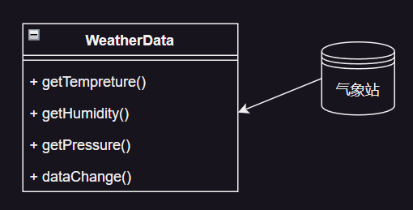
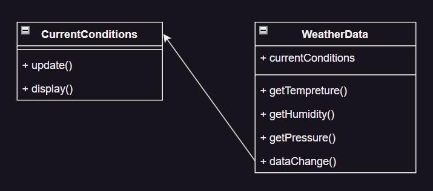
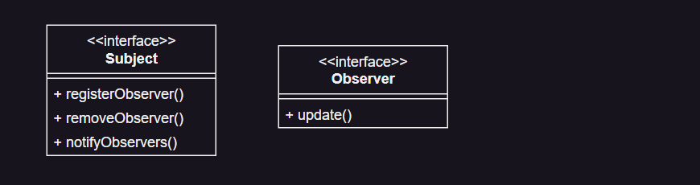
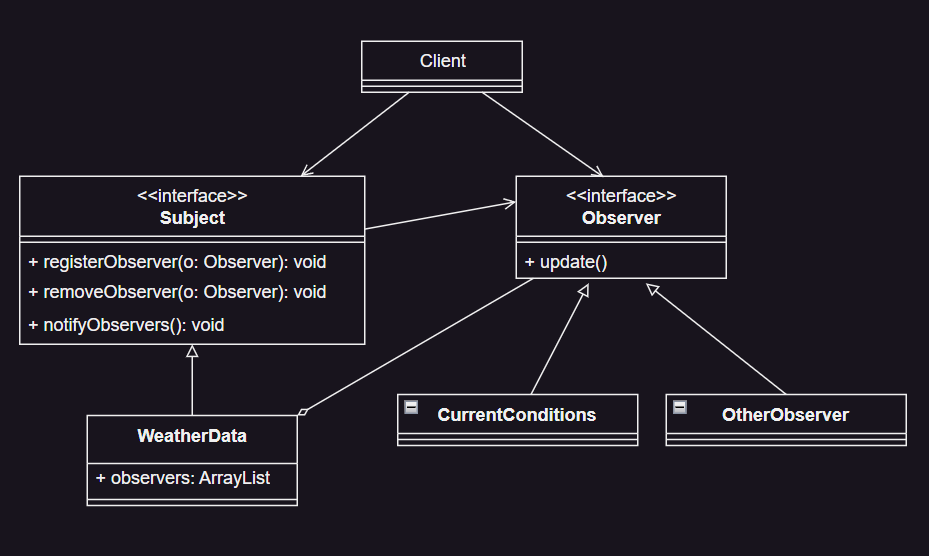

# 观察者模式

## 天气预报项目需求

1. 气象站可以将每天的测量数据发布出去（比如发布到自己的网站或提供给第三方）
2. 需要设计开放型 API，便于第三方也能接入气象站获取数据
3. 提供获取温度，气压和湿度的接口
4. 测量数据更新时，需要实时通知给第三方

## 设计方案1 - 普通方案

### 拉取模式

说明：

1. 通过 `getX()` 方法，让第三方获取相关信息；
2. 气象站调用 `dataChange()` 方法去更新数据，当第三方再次获取数据时，就能得到最新数据，当然也可以推送。

### 推送模式

说明：

1. `WeatherData` 类在更新数据时调用 `currentConditions` 的 `update()` 方法。
2. [推送模式代码](https://github.com/dquaner/Design-Pattern/tree/main/samples/src/main/java/org/dyy/behavioral/observer/push)

### 普通方案问题分析

1. 其他第三方接入气象台的获取数据的问题
2. 无法在运行时动态的添加第三方

说明：当需要增加一个第三方，都必须要在 `WeatherData` 中新创建一个对应的第三方公告板对象，并在 `dataChange()` 方法中添加新对象的 update 逻辑，不利于维护，也不是动态加入。
这就违反了 OCP 原则（对扩展开放，对修改关闭）。

## 设计方案2 - 观察者模式

### 观察者模式原理

观察者模式类似于订牛奶业务：

1. 奶站/气象局：Subject
2. 用户/第三方网站：Observer

**Subject:** 登记注册、移除和通知

1. registerObserver()
2. removeObserver()
3. notifyObservers() - 通知所有注册用户，根据不同需求，可能是更新数据让用户来取（pull），也可能时实时推送（push）

**Observer:** 接收输入

1. update() - 收到通知后做出相应的动作

**总结观察者模式：**

对象之间多（Observer）对一（Subject）依赖的一种设计方案，被依赖的对象为 `Subject`，依赖的对象为 `Observer`，Subject 通知 Observers 变化。

[观察者模式代码](https://github.com/dquaner/Design-Pattern/tree/main/samples/src/main/java/org/dyy/behavioral/observer/improve)

**观察者模式好处：**

以集合的方式管理 Observers，包括注册、移除和通知，这样我们增加观察者的时候，不需要去修改核心类 `WeatherData`，遵守了 OCP 原则。

## JDK 应用的源码分析

- `Observable` and `Observer`
- Deprecated since "9"
- see `java.util.concurrent.Flow`