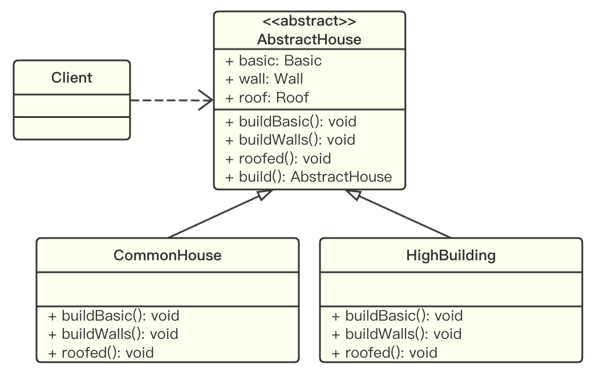
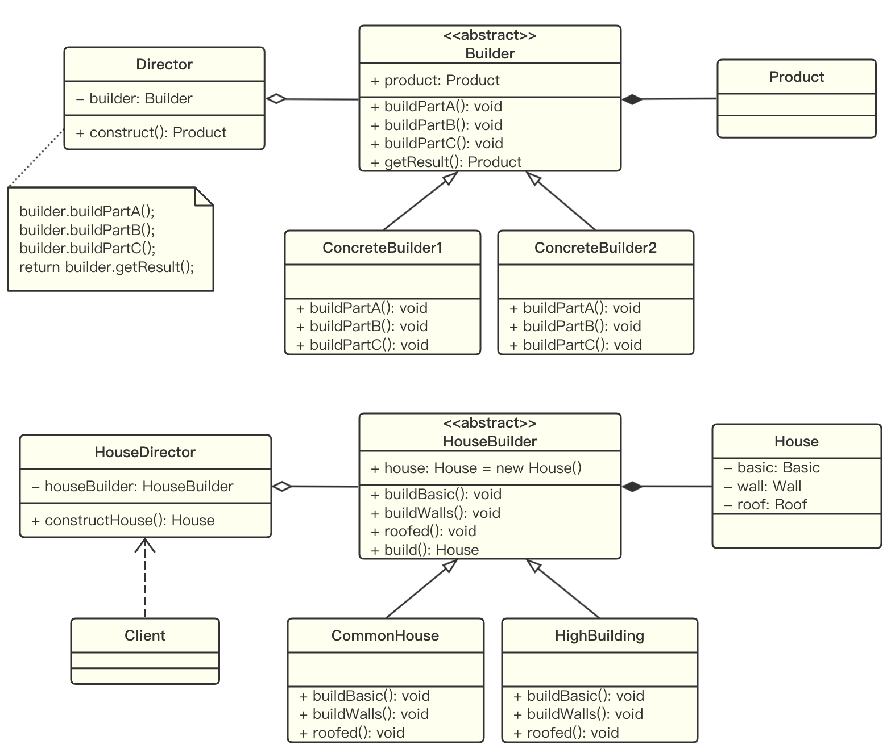

# 建造者模式

## 应用实例

**盖房项目需求：**

1. 建房子的流程包括：打桩，砌墙，封顶；
2. 房子有各种各样的：比如普通房、高楼、别墅，各种类型的房子建造流程虽然一样，但要求不相同。

**传统实现方法：**

示例代码：[HouseBuilder](https://github.com/dquaner/Design-Pattern/tree/main/samples/src/main/java/org/dyy/dp/builder/uc)



**分析：**

1. 优点：比较好理解，简单易操作。
2. 缺点：程序结构过于简单，没有设计缓存层对象，程序的扩展性和可维护性较差。也就是说，这种方案把产品（房子）和创建产品的过程（建房流程）封装在了一起，耦合性增强了。
3. 解决方案：将产品和产品建造过程进行结耦，也就是建造者模式。

## 建造者模式基本介绍

建造者模式又叫生成器模式，是一种对象构建模式。它可以将复杂对象的建造过程抽象出来（抽象类别），是这个抽象过程的不同实现方法可以构造出不同表现（属性）的对象。

建造者模式是一步一步生成一个复杂的对象，它允许用户只通过指定复杂对象的类型和内容就可以构建它们，用户不需要知道内部的具体构建细节。

**建造者模式的四个角色：**

1. Product（产品）：一个具体的产品对象。
2. Builder（抽象建造者）：创建一个 Product 对象的各个部件指定的接口/抽象类。
3. ConcreteBuilder（具体建造者）：实现接口，构建和装配各个部件。
4. Director（指挥者）：构建一个使用 Builder 接口的对象，用于创建一个复杂的对象。它主要有两个作用，一是隔离了客户与对象的生产过程；二是负责控制产品对象的生产过程。

## 建造者模式的实现

示例代码：[HouseBuilder](https://github.com/dquaner/Design-Pattern/tree/main/samples/src/main/java/org/dyy/dp/builder/improve)



## 建造者模式在 JDK 中应用的源码分析

JDK 中的 [java.lang.StringBuilder](https://docs.oracle.com/javase/8/docs/api/java/lang/StringBuilder.html) 使用了建造者模式。

源码分析：

1. `Appendable` 是一个抽象建造者：

```java
public interface Appendable {
    Appendable append(CharSequence csq) throws IOException;

    Appendable append(CharSequence csq, int start, int end) throws IOException;

    Appendable append(char c) throws IOException;
}
```

2. `AbstractStringBuilder` 是一个建造者，实现了 `Appendable` 的接口方法：

```java
abstract class AbstractStringBuilder implements Appendable {
    AbstractStringBuilder() {
        value = EMPTYVALUE;
    }

    @Override
    public AbstractStringBuilder append(CharSequence s) {
        ...
    }

    @Override
    public AbstractStringBuilder append(CharSequence s, int start, int end) {
        ...
    }

    @Override
    public AbstractStringBuilder append(char c) {
        ...
    }

}
```

3. `StringBuilder` 既充当了指挥者角色，同时充当了具体建造者，建造方法的实现是由 `AbstractStringBuilder` 完成的。

## 注意事项和细节说明

建造者模式的注意事项和细节说明：

1. 客户端不必知道产品内部组成的细节，将产品本身与产品的创建过程结耦，使得相同的创建过程可以创建不同的产品对象。
2. 每一个具体建造者都相对独立，而与其他的具体建造者无关，因此可以很方便地替换具体建造者或增加新的具体建造者，用户使用不同的具体建造者即可得到不同的产品对象。
3. 可以更加精细地控制产品的创建过程。将复杂产品的创建步骤分解在不同的方法中，使得创建过程更加清晰，也更方便使用程序来控制创建过程。
4. 增加新的具体建造者无需修改原有的代码，指挥者类针对抽象建造者类编程，系统扩展方便，符合开闭原则。
5. 建造者模式所创建的产品一般具有较多的共同点，其组成部分相似，如果产品之间的差异性很大，就不适合使用建造者模式。因此其使用范围受到一定的限制。
6. 如果产品的内部变换复杂，可能会导致需要定义很多具体建造者类来实现这种变化，导致系统变得很庞大。因此在这种情况下，需要慎重考虑是否使用建造者模式。
7. 抽象工厂模式 vs 建造者模式：抽象工厂模式实现对产品家族的创建，一个产品家族必须是具有不同分类维度的产品组合，采用抽象工厂模式不需要关心构建过程，只需要关心什么产品由什么工厂生产即可；而建造者模式则是要求按照指定的蓝图建造产品，它的主要目的是通过组装零配件生产一个新产品。
