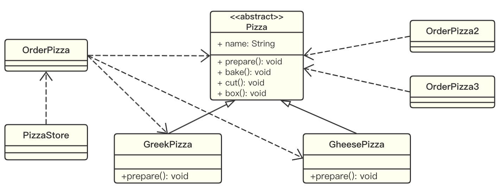
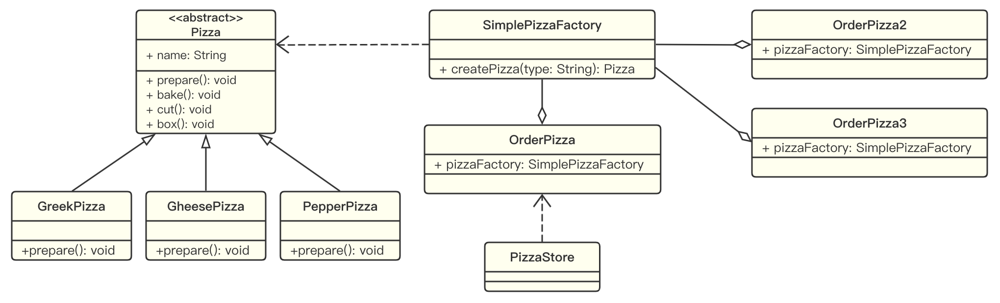
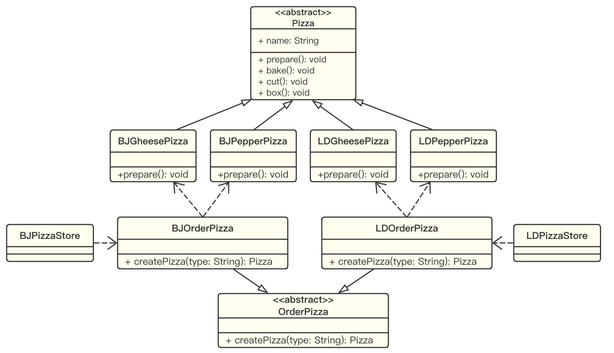
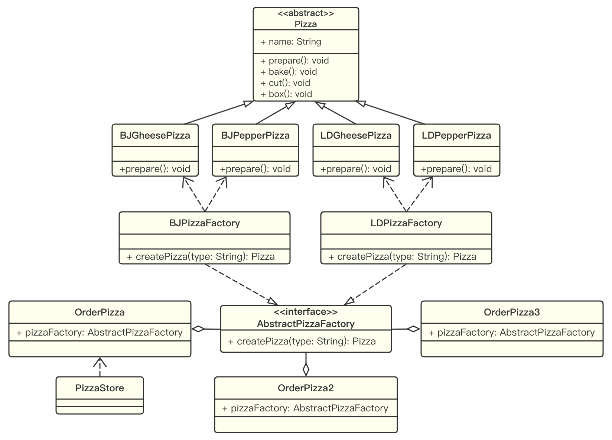

# 工厂模式

## 简单工厂模式

### 用例分析

完成一个披萨订购程序，要求便于披萨种类的扩展，便于维护：

1. 披萨的种类很多，比如 GreekPizz，CheesePizz 等；
2. 披萨的制作流程包括 prepare，bake，cut，box；
3. 完成披萨店订购功能。

**传统实现方法：**

示例代码：[PizzaStore](https://github.com/dquaner/Design-Pattern/tree/main/samples/src/main/java/org/dyy/dp/factory/uc)



**分析：**

1. 优点是设计简单，容易理解。
2. 缺点是违反了设计模式的 ocp (Open-CLose Principle) 原则，即对扩展开放，对修改关闭；如果增加一个新的种类，所有创建 Pizza 的代码逻辑都需要修改。修改代码可以接受，但是如果我们在其他的地方也有创建 Pizza 的代码，就意味着也需要修改，而创建 Pizza 的代码往往有多处。
3. 改进的思路：把创建 Pizza 对象的代码逻辑封装在一个类中，这样我们有新的 Pizza 种类时，只需要修改该类就可以，这就是**简单工厂模式**。

### 简单工厂模式基本介绍

1. 简单工厂模式属于创建型模式，是工厂模式家族中最为简单实用的一种。简单工厂模式**由一个工厂对象决定创建出哪一种产品的实例**。
2. 简单工厂模式：定义了一个创建对象的类，由这个类来封装实例化对象的行为。
3. 在软件开发中，当我们会用到大量的创建某种、某类或某批对象时，就会使用到工厂模式。

### 简单工厂模式的实现

示例代码：[PizzaStore](https://github.com/dquaner/Design-Pattern/tree/main/samples/src/main/java/org/dyy/dp/factory/simplefactory)



## 工厂方法模式

### 用例分析

假设 Pizza 项目有一个新的需求：客户在点单时，可以点不同分店不同口味的 pizza，比如北京的 cheese pizza，北京的 greek pizza，伦敦的 cheese pizza，伦敦的 pepper pizza 等。

**思路1：**

使用简单工厂模式，创建不同的简单工厂类，比如 BJPizzaFactory，LDPizzaFactory 等。从当前这个案例来说，这么做也是可以的，但是考虑到项目的规模，以及软件的可维护性、可扩展性，并不是特别好。

**思路2：**

使用工厂方法模式。

### 工厂方法模式简单介绍

工厂方法模式定义了一个创建对象的抽象方法，由子类决定要实例化的类。也就是说，将对象的实例化推迟到子类。

### 工厂方法模式的实现

使用工厂方法模式的设计方案：将 Pizza 实例化的逻辑抽象成抽象方法，在不同的点餐子类中具体实现。

示例代码：[PizzaStore](https://github.com/dquaner/Design-Pattern/tree/main/samples/src/main/java/org/dyy/dp/factory/factorymethod)



## 抽象工厂模式

### 抽象工厂模式基本介绍

抽象工厂模式定义了一个接口用于创建相关或有依赖关系的对象簇，而无需指明具体的类。

1. 抽象工厂模式可以将简单工厂模式和工厂方法模式进行整合。
2. 从设计层面看，抽象工厂模式就是对简单工厂模式的改进，或者称为进一步的抽象。
3. 将工厂抽象成两层：抽象工厂和具体实现的工厂子类。开发者可以根据要创建的对象类型使用对应的工厂子类。这样将单个的简单工厂变成了工厂簇，有利于项目的维护和扩展。

### 抽象工厂模式的实现

示例代码：[PizzaStore](https://github.com/dquaner/Design-Pattern/tree/main/samples/src/main/java/org/dyy/dp/factory/absfactory)



## 工厂模式在 JDK 中应用的源码分析

JDK 中的 [java.util.Calendar](https://docs.oracle.com/javase/8/docs/api/java/util/Calendar.html) 对象的创建就使用了简单工厂模式。

使用 `Calendar` 时我们需要首先创建一个对象实例：

```java
Calendar calendar = Calendar.getInstance();
```

源码分析：

```java
public abstract class Calendar {
    ...
    /**
     * 静态方法，返回一个 Calendar 实例
     */
    public static Calendar getInstance() {
        // 根据时区和地区创建对应的 Calendar 实例
        return createCalendar(TimeZone.getDefault(), Locale.getDefault(Locale.Category.FORMAT));
    }

    private static Calendar createCalendar(TimeZone zone, Locale aLocale) {
        // 首先尝试从 CalendarProvider 获取 Calendar
        CalendarProvider provider =
            LocaleProviderAdapter.getAdapter(CalendarProvider.class, aLocale)
                                 .getCalendarProvider();
        if (provider != null) {
            try {
                return provider.getInstance(zone, aLocale);
            } catch (IllegalArgumentException iae) {
                // fall back to the default instantiation
            }
        }
        // 如果没有从 CalendarProvider 获取到 Calendar
        // 则根据 caltype 创建对应的 Calendar 实例（简单工厂模式）
        Calendar cal = null;
        if (aLocale.hasExtensions()) {
            String caltype = aLocale.getUnicodeLocaleType("ca");
            if (caltype != null) {
                switch (caltype) {
                case "buddhist":
                cal = new BuddhistCalendar(zone, aLocale);
                    break;
                case "japanese":
                    cal = new JapaneseImperialCalendar(zone, aLocale);
                    break;
                case "gregory":
                    cal = new GregorianCalendar(zone, aLocale);
                    break;
                }
            }
        }
        // 如果使用 caltype 也创建失败
        // 则根据 language, country 和 variant 创建对应的 Calendar 实例（简单工厂模式）
        if (cal == null) {
            if (aLocale.getLanguage() == "th" && aLocale.getCountry() == "TH") {
                cal = new BuddhistCalendar(zone, aLocale);
            } else if (aLocale.getVariant() == "JP" && aLocale.getLanguage() == "ja"
                       && aLocale.getCountry() == "JP") {
                cal = new JapaneseImperialCalendar(zone, aLocale);
            } else {
                cal = new GregorianCalendar(zone, aLocale);
            }
        }
        return cal;
    }
    ...
}
```

## 小结

**工厂模式的意义：**

将实例化对象的代码提取出来，放到一个类中统一管理和维护，达到和主项目依赖关系的解耦，从而提高项目的可扩展性和可维护性。

**三种工厂设计模式：**

1. 简单工厂模式
2. 工厂方法模式
3. 抽象工厂模式

**设计模式的依赖倒置原则：**

1. 创建对象时，把 new 类的动作放在一个工厂的方法中，并返回类的实例；也就是说，变量不要直接持有具体类的引用。
2. 不要让类继承具体类，而是继承抽象类或实现接口。
3. 不要覆盖父类中已经实现的方法。
