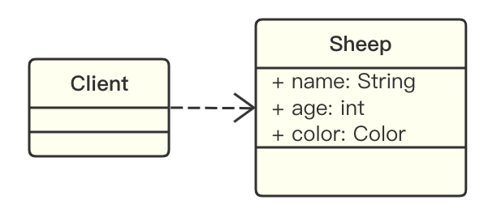
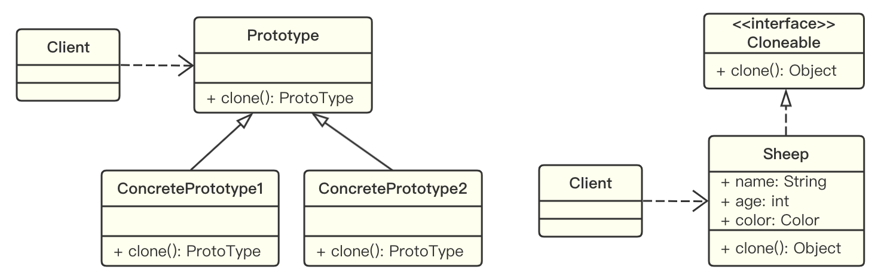

# 原型模式

## 用例分析

**克隆羊问题：**

有一只羊姓名为 Tom ，年龄为 1 ，颜色为白色，请编写程序创建和 Tom 属性完全相同的 10 只羊。

**传统实现方法：**

示例代码：[Sample](https://github.com/dquaner/Design-Pattern/tree/main/samples/src/main/java/org/dyy/dp/prototype/uc)



**分析：**

1. 优点是比较好理解，简单易操作。
2. 但是在创建新的对象时，总是需要重新获取原始对象的属性，如果创建的对象比较复杂时，效率较低。比如，创建对象需要的属性很多；而且总是需要重新初始化对象，而不是动态地获取对象运行时的状态，不够灵活。
3. 改进的思路分析：Java 中的 `Object` 类是所有类的基类，Object 类提供了一个 `clone()` 方法，该方法可以将一个 Java 对象复制一份，但是需要实现 clone 的类必须要实现一个接口 `Cloneable` ，这个接口表示该类能够复制并且具有复制的能力，即原型模式。

## 原型模式基本介绍

原型模式是指用原型实例指定创建对象的种类，并且通过拷贝这些原型，创建新的对象。

1. 原型模式是一种创建型设计模式，允许一个对象再创建另一个可定制的对象，并且无需知道创建的细节。
2. 原型模式的工作原理是：将一个原型对象传给那个要发动创建的类，这个发动创建的类通过请求原型对象拷贝它们自己来实现创建，即 `object.clone()` 。

## 原型模式的实现

示例代码：[Sample](https://github.com/dquaner/Design-Pattern/tree/main/samples/src/main/java/org/dyy/dp/prototype/improve)



说明：

1. Prototype：原型类，声明一个克隆自己的方法
2. ConcretePrototype：具体的原型类，实现克隆自己的操作
3. Client：让一个原型对象克隆自己，从而创建一个新的对象（即属性一样）

## 原型模式在 Spring 中应用的源码分析

Spring 中原型 bean 的创建，就是原型模式的应用（?）。

源码分析：

```java
@Override
public Object getBean(String name) throws BeansException {
	return doGetBean(name, null, null, false);
}

/**
 * 返回指定 bean 的实例
 */
@SuppressWarnings("unchecked")
protected <T> T doGetBean(String name, @Nullable Class<T> requiredType, @Nullable Object[] args, boolean typeCheckOnly) 
    throws BeansException {
	String beanName = transformedBeanName(name);
	Object beanInstance;
	// 检查缓存 ...
	else {
        // fail if prototype currently in creation ...
        // 检查 parent bean factory ...
        try {
            // prepare ...
            // 创建 bean 实例
            if (mbd.isSingleton()) { // 单例 ... 
            }
            else if (mbd.isPrototype()) {
                // 如果 scope 为 Prototype，则创建一个新的实例
                Object prototypeInstance = null;
                try {
                    beforePrototypeCreation(beanName); // register the prototype as currently in creation.
                    // 并没有用 clone 啊... 每次都去调用了定义的 sheep() 方法
                    prototypeInstance = createBean(beanName, mbd, args);
                }
                finally {
                    afterPrototypeCreation(beanName);
                }
                beanInstance = getObjectForBeanInstance(prototypeInstance, name, beanName, mbd);
            } 
            else { // 其他 scope ...
            }
        } catch (BeansException ex) {
            // 处理错误 ...
        } finally {
            beanCreation.end();
        }
    }
    return adaptBeanInstance(name, beanInstance, requiredType);
}
```

## 深拷贝和浅拷贝

**浅拷贝的介绍：**

1. 对于基本数据类型的成员变量，浅拷贝会直接进行值传递，也就是将该属性值复制一份给新的对象。
2. 对于引用数据类型的成员变量，比如某个数组，某个类的对象等，浅拷贝会进行引用传递，也就是只将该成员变量的引用值（内存地址）复制一份给新的对象。两个对象的引用类型成员变量实际上都指向同一个实例，因此在这种情况下，修改一个对象中的引用类型成员变量会影响另一个对象的该成员变量。
3. 前面的克隆羊实例就是浅拷贝。浅拷贝使用默认的 `clone()` 方法实现。

示例代码：[Sample](https://github.com/dquaner/Design-Pattern/tree/main/samples/src/main/java/org/dyy/dp/prototype/shallowcopy)

**深拷贝的介绍：**

1. 复制对象的所有基本数据类型的成员变量值。
2. 为所有引用数据类型的成员变量申请存储空间，并复制每个引用类型成员变量所引用的对象，直到该对象可达的所有对象。也就是说，深拷贝要对整个对象进行拷贝。
3. 深拷贝的实现方式1：重写 `clone()` 方法来实现深拷贝。如果引用类型里面还包含很多引用类型，或者内层引用类型的类里面又包含多层引用类型，那么通过 `clone()` 方法逐一拷贝每一个引用类型来实现深拷贝的方法就会很麻烦。
4. 深拷贝的实现方式2：通过对象序列化来实现深拷贝（推荐）。序列化就是将对象写到流中的过程，写到流中的对象是原有对象的一个拷贝，而原对象仍然存在于内存中。通过序列化实现的拷贝不仅可以复制对象本身，而且可以复制其引用的成员对象。需要注意的是序列化对象的类必须实现 `Serializable` 接口，否则无法实现序列化操作。

示例代码：[Sample](https://github.com/dquaner/Design-Pattern/tree/main/samples/src/main/java/org/dyy/dp/prototype/deepcopy)

## 注意事项和细节说明

原型模式的注意事项和细节说明：

1. 创建新的对象比较复杂时，可以利用原型模式简化对象的创建过程，同时也能够提高效率。
2. 不用重新初始化对象，而是动态地获得对象运行时的状态。
3. 如果原始对象发生变化（增加或者减少属性），其他克隆对象的属性也会发生相应的变化，无需修改代码。
4. 在实现深克隆的时候可能需要比较复杂的代码。
5. 缺点：需要为每一个类配备一个克隆方法，这对全新的类来说不是很难，但对已有的类进行改造时，需要修改其源代码，违背了开闭原则。
