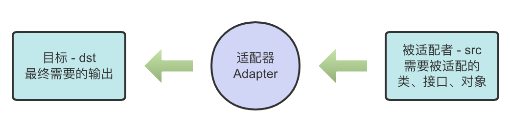

# 适配器模式

## 适配器模式基本介绍

适配器模式（Adapter Pattern）将某个类的接口转换成客户端期望的另一个接口表示，主要目的是兼容性，让原本因接口不匹配不能一起工作的两个类可以协同工作，其别名为包装器（Wrapper）。

适配器模式属于结构型模式，主要分为三类：类适配器模式、对象适配器模式、接口适配器模式。多功能转换插头就是一个现实中的适配器例子。

## 适配器模式的工作原理

1. 适配器模式：将一个类的接口转换成另一种接口，让原本接口不兼容的类可以兼容；
2. 从用户的角度看不到被适配者，因此适配器模式是结耦的；
3. 用户调用适配器转化出来的目标接口方法，而适配器会去调用被适配者的相关接口方法；
4. 用户收到反馈结果，感觉自己是和目标接口交互的。



## 类适配器模式

### 基本介绍

类适配器模式创建一个 Adapter 类，通过继承 src 类，实现 dst 接口，完成 src 到 dst 的适配。

### 应用实例

以生活中充电器的例子来讲解适配器，充电器本身相当于 Adapter，220V 交流电相当于 src（即被适配者），我们的 dst（即目标）是 5V 直流电。


示例代码：[VoltageAdapter](../samples/src/main/java/org/dyy/dp/adapter/classadapter/VoltageAdapter.java)

### 类适配器的注意事项和细节

1. 由于 Java 是单继承机制，所以类适配器需要继承 src 类这一点是它的一个缺点，因为这要求 dst 必须为一个接口，有一定的局限性；
2. src 类的方法在 Adapter 中都会暴露出来，也增加了使用的成本。
3. 类适配器的优点：由于其继承了 src 类，所以它可以根据需求重写 src 类的方法，使得 Adapter 的灵活性增强了。

## 对象适配器模式

### 基本介绍

1. 对象适配器模式的基本思路和类适配器相同，只是将 Adapter 类做修改，不是继承 src 类，而是持有 src 类的实例，以解决接口兼容性的问题。即 Adapter 类持有 src 类，实现 dst 接口，完成 src 到 dst 的适配。
2. 这一改动满足“合成复用原则”，即：在系统中尽量使用关联关系来替代继承关系。
3. 对象适配器模式是适配器模式常用的一种。

### 应用实例


示例代码：[VoltageAdapter](../samples/src/main/java/org/dyy/dp/adapter/objectadapter/VoltageAdapter.java)

### 对象适配器的注意事项和细节

1. 对象适配器和类适配器其实算是同一种思想，只不过实现方式不同。根据合成复用原则，使用组合代替继承，所以它解决了类适配器必须继承 src 的局限性问题，也不再要求 dst 必须是接口。
2. 对象适配器的使用成本更低，更灵活。

## 接口适配器模式

### 基本介绍

1. 一些书籍称接口适配器模式为适配器模式或缺省适配器模式（Default Adapter Pattern）。
2. 当不需要实现接口提供的全部方法时，可以先设计一个抽象类实现接口，并为该接口中的每个方法提供一个默认实现（空方法），那么该抽象类的子类可以有选择的覆盖父类的某些方法来实现需求。
3. 接口适配器适用于一个接口不想使用其所有方法的情况。

### 应用实例

Android 中的属性动画 `ValueAnimator` 类可以通过 `addListener(AnimatorListener listener)` 方法添加监听器：

```java
ValueAnimator valueAnimator = ValueAnimator.ofInt(0, 100);
valueAnimator.addListener(new Animator.AnimatorListener(){
    @Override
    public void onAnimatorStart(Animator animation) {

    }
    @Override
    public void onAnimatorEnd(Animator animation) {
        
    }
    @Override
    public void onAnimatorCancel(Animator animation) {
        
    }
    @Override
    public void onAnimatorRepeat(Animator animation) {
        
    }
});
valueAnimator.start();
```

有时候我们不想实现 `Animator.AnimatorListener` 接口的全部方法，我们只想监听 `onAnimatorStart` ：

```java
ValueAnimator valueAnimator = ValueAnimator.ofInt(0, 100);
valueAnimator.addListener(new Animator.AnimatorListenerAdapter(){ // 匿名内部类
    @Override
    public void onAnimatorStart(Animator animation) {
        // 具体实现
    }
});
valueAnimator.start();
```

其中，`AnimatorListenerAdapter` 类就是一个接口适配器，它空实现了 `Animator.AnimatorListener` （src）接口的所有方法：

```java
public abstract class AnimatorListenerAdapter implements Animator.AnimatorListener, Animator.AnimatorPauseListener {
    @Override
    public void onAnimatorStart(Animator animation) {

    }
    @Override
    public void onAnimatorEnd(Animator animation) {
        
    }
    @Override
    public void onAnimatorCancel(Animator animation) {
        
    }
    @Override
    public void onAnimatorRepeat(Animator animation) {
        
    }
    @Override
    public void onAnimatorPause(Animator animation) {
        
    }
    @Override
    public void onAnimatorResume(Animator animation) {
        
    }
}
```

程序中的匿名内部类就是 AnimatorListenerAdapter 的具体实现类。

## 适配器模式在 SpringBoot 框架中应用的源码分析

SprintBoot 中的 `HandlerAdapter` 就使用了适配器模式。

### SpringMVC 处理请求的流程回顾


### 源码分析

当 `DispatcherServlet` 接收到请求时，会调用 `doDispatch(HttpServletRequest request, HttpServletResponse response)` 方法进行处理。首先根据请求拿到 `mappedHandler` ，这个 handler 实际上就是对应的能够处理请求的 controller 。然后遍历 HandlerAdapters 获取第一个支持当前 handler 的 `HandlerAdapter` ，不同的 handler 需要使用对应的 handler adapter 去处理（调用）。源码如下：

```java
/**
 * Process the actual dispatching to the handler.
 * <p>The handler will be obtained by applying the servlet's HandlerMappings in order.
 * The HandlerAdapter will be obtained by querying the servlet's installed HandlerAdapters
 * to find the first that supports the handler class.
 * <p>All HTTP methods are handled by this method. It's up to HandlerAdapters or handlers
 * themselves to decide which methods are acceptable.
 * @param request current HTTP request
 * @param response current HTTP response
 * @throws Exception in case of any kind of processing failure
 */
@SuppressWarnings("deprecation")
protected void doDispatch(HttpServletRequest request, HttpServletResponse response) throws Exception {
    HttpServletRequest processedRequest = request;
    HandlerExecutionChain mappedHandler = null;
    boolean multipartRequestParsed = false;
    
    WebAsyncManager asyncManager = WebAsyncUtils.getAsyncManager(request);
    try {
        ModelAndView mv = null;
        Exception dispatchException = null;
        try {
            processedRequest = checkMultipart(request);
            multipartRequestParsed = (processedRequest != request);
            
            // Determine handler for the current request.
            // 通过 HandlerMappings 映射 Controller
            mappedHandler = getHandler(processedRequest);
            if (mappedHandler == null) {
                noHandlerFound(processedRequest, response);
                return;
            }
            
            // 获取适配器
            // Determine handler adapter for the current request.
            HandlerAdapter ha = getHandlerAdapter(mappedHandler.getHandler());
            
            // Process last-modified header, if supported by the handler.
            String method = request.getMethod();
            boolean isGet = HttpMethod.GET.matches(method);
            if (isGet || HttpMethod.HEAD.matches(method)) {
                long lastModified = ha.getLastModified(request, mappedHandler.getHandler());
                if (new ServletWebRequest(request, response).checkNotModified(lastModified) && isGet) {
                    return;
                }
            }
            
            if (!mappedHandler.applyPreHandle(processedRequest, response)) {
                return;
            }
            
            // 通过适配器调用 controller 的方法并返回 ModelAndView
            // Actually invoke the handler.
            mv = ha.handle(processedRequest, response, mappedHandler.getHandler());
            
            if (asyncManager.isConcurrentHandlingStarted()) {
                return;
            }
            
            applyDefaultViewName(processedRequest, mv);
            mappedHandler.applyPostHandle(processedRequest, response, mv);
        }
        catch (Exception ex) {
            dispatchException = ex;
        }
        catch (Throwable err) {
            // As of 4.3, we're processing Errors thrown from handler methods as well,
            // making them available for @ExceptionHandler methods and other scenarios.
            dispatchException = new NestedServletException("Handler dispatch failed", err);
        }
        processDispatchResult(processedRequest, response, mappedHandler, mv, dispatchException);
    }
    catch (Exception ex) {
        triggerAfterCompletion(processedRequest, response, mappedHandler, ex);
    }
    catch (Throwable err) {
        triggerAfterCompletion(processedRequest, response, mappedHandler, 
            new NestedServletException("Handler processing failed", err));
    }
    finally {
        if (asyncManager.isConcurrentHandlingStarted()) {
            // Instead of postHandle and afterCompletion
            if (mappedHandler != null) {
                mappedHandler.applyAfterConcurrentHandlingStarted(processedRequest, response);
            }
        }
        else {
            // Clean up any resources used by a multipart request.
            if (multipartRequestParsed) {
                cleanupMultipart(processedRequest);
            }
        }
    }
}
```

Spring 创建了一个适配器接口 `HandlerAdapter` ：


该适配器接口 `HandlerAdapter` 的实现子类使得每一种 controller 有自己对应的适配器实现类，来达到不同的实现方式。也就是说，实际上是通过 adapter 来调用具体的 handler（controller）的处理方法：


### 使用 HandlerAdapter 的原因分析

由于 controller 的类型不同，调用 controller 方法的方式是不确定的。如果不使用 adapter ，直接调用 controller 的方法，那么代码逻辑就得不断的使用 if-else 来进行判断是哪一种子类然后执行；如果后面需要扩展 controller ，就得修改原来的代码，违反了开闭原则。

### 手写 HandlerAdapter


代码示例：[DispatcherServlet](../samples/src/main/java/org/dyy/dp/adapter/spring/DispatcherServlet.java)
