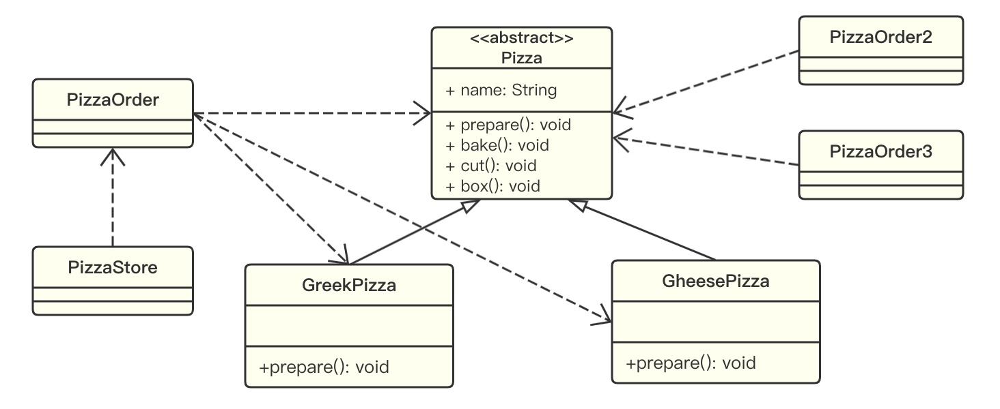
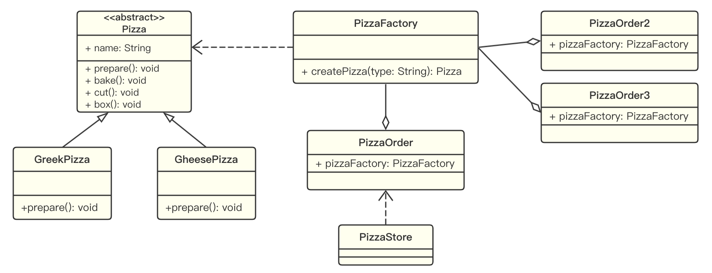

# 工厂模式

## 应用示例

完成一个披萨订购程序，要求便于披萨种类的扩展，便于维护：

1. 披萨的种类很多，比如 GreekPizz，CheesePizz 等；
2. 披萨的制作流程包括 prepare，bake，cut，box；
3. 完成披萨店订购功能。

### 传统实现方法

**示例：**

[PizzaStore]()

**分析：**

1. 优点是设计简单，容易理解。
2. 缺点是违反了设计模式的 ocp (Open-CLose Principle) 原则，即对扩展开放，对修改关闭；如果增加一个新的种类，所有创建 Pizza 的代码逻辑都需要修改。修改代码可以接受，但是如果我们在其他的地方也有创建 Pizza 的代码，就意味着也需要修改，而创建 Pizza 的代码往往有多处。
3. 改进的思路：把创建 Pizza 对象的代码逻辑封装在一个类中，这样我们有新的 Pizza 种类时，只需要修改该类就可以，这就是**简单工厂模式**。

## 简单工厂模式

### 基本介绍

1. 简单工厂模式属于创建型模式，是工厂模式家族中最为简单实用的一种。简单工厂模式**由一个工厂对象决定创建出哪一种产品的实例**。
2. 简单工厂模式：定义了一个创建对象的类，由这个类来封装实例化对象的行为。
3. 在软件开发中，当我们会用到大量的创建某种、某类或某批对象时，就会使用到工厂模式。

### 应用实例

[PizzaStore]()

## 工厂方法模式

## 抽象工厂模式

## 工厂模式在 JDK 中应用的源码分析