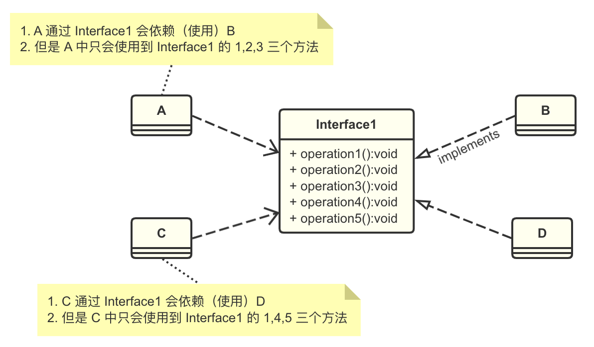
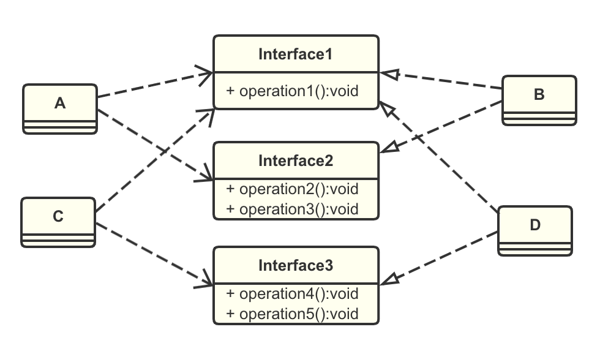
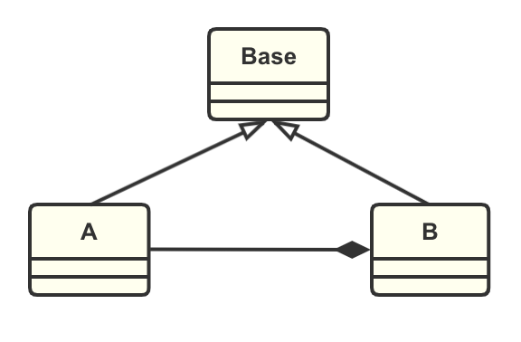
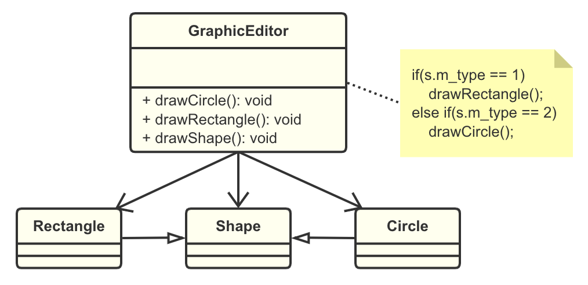
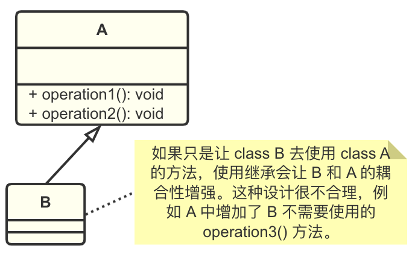
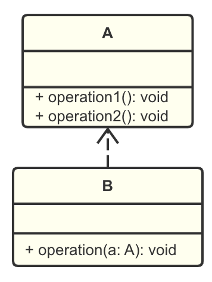
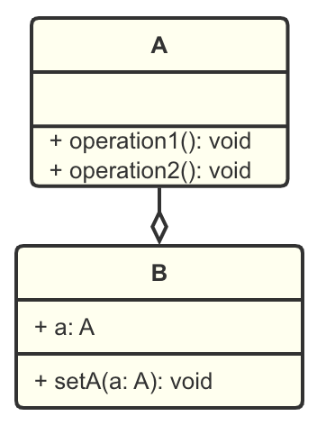
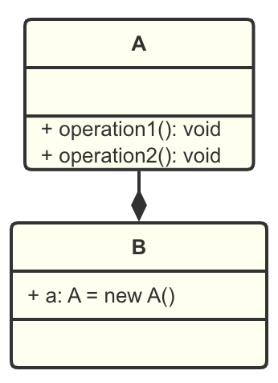

# 设计模式：设计原则

软件工程中，设计模式（design pattern）是对软件设计中**普遍存在**的（**反复出现**）的各种问题，所提出的**解决方案**。

设计模式的目的：
- 增强代码的重用性
- 可读性（编程规范性）
- 可扩展性（可维护性，易于添加新的功能）
- 可靠性（增加新的功能后，对原来的功能没有影响）
- 使程序呈现高内聚，低耦合的特性

设计模式本身要遵守的七个原则：
1. 单一职责原则（Single Responsibility Principle）
2. 接口隔离原则（Interface Segregation Principle）
3. 依赖倒置原则（Denpendency Inversion Principle）
4. 里氏替换原则（Liskov Substitution Principle）
5. 开闭原则（Open Closed Principle）
6. 迪米特法则（Demeter Principle）
7. 合成复用原则（Composite Reuse Principle）

# 1.单一职责原则
## 基本介绍
一个类应该只负责一项职责。

例如，class A 负责两个不同的两个职责：职责1，职责2。当因为 职责1 需求变更而改变 A 时，有可能造成 职责2 的执行错误，所以需要将 class A 分解为更细粒度的 A1，A2。

## 应用实例
以交通工具类为例：

<i>Example 1.</i>

```java
public class SingleResponsibility {
    public static void main(String[] args) {
        Vehicle vehicle = new Vehicle();
        vehicle.run("motorbike");
        vehicle.run("car");
        vehicle.run("plane"); // 逻辑错误
    }
}

/**
 * 1. 违反了单一职责原则
 * 2. 改进：为不同的交通工具创建不同的类 -> Example 2
 */
class Vehicle {
    public void run(String vehicle) {
        System.out.println(vehicle + " running on the road...");
    }
}
```

<i>Example 2.</i>

```java
public class SingleResponsibility2 {
    public static void main(String[] args) {
        RoadVehicle roadvehicle = new RoadVehicle();
        roadvehicle.run("motorbike");
        roadvehicle.run("car");
        AirVehicle airVehicle = new AirVehicle();
        airVehicle.run("plane");
    }
}

/**
 * 1. 遵守单一职责原则
 * 2. 但是这样做改动很大，即将类分解，同时要修改客户端
 * 3. 改进：直接修改 Vehicle 类，改动的代码比较少 -> Example 3
 */
class RoadVehicle {
    public void run(String vehicle) {
        System.out.println(vehicle + " running on the road...");
    }
}

class AirVehicle {
    public void run(String vehicle) {
        System.out.println(vehicle + " running in the air...");
    }
}

class WaterVehicle {
    public void run(String vehicle) {
        System.out.println(vehicle + " running in the water...");
    }
}
```

<i>Example 3.</i>

```java
public class SingleResponsibility3 {
    public static void main(String[] args) {
        Vehicle vehicle = new Vehicle();
        vehicle.runRoad("car");
        vehicle.runAir("plane");
        vehicle.runWater("boat");
    }
}

/**
 * 1. 这种修改方法没有对原来的类做大的修改，只是增加方法
 * 2. 虽然没有在类级别上遵守单一职责原则，但在方法级别上，仍然遵守了单一职责
 */
class Vehicle {
    public void runRoad(String vehicle) {
        System.out.println(vehicle + " running on the road...");
    }

    public void runAir(String vehicle) {
        System.out.println(vehicle + " running in the air...");
    }

    public void runWater(String vehicle) {
        System.out.println(vehicle + " running in the water...");
    }
}
```

## 注意事项和细节
1. 降低类的复杂度，一个类只负责一项职责
2. 提高类的可读性，可维护性
3. 降低变更一个职责带来的风险
4. 通常情况下，我们应该遵守单一职责原则；只有逻辑足够简单时，才可以在类级别违反单一职责；只有类中的方法足够少时，可以在方法级别保持单一职责原则。

# 2.接口隔离原则
## 基本介绍
客户端不应该依赖的接口中不应该有它不需要的方法，即**一个类对另一个类的依赖应该建立在最小的接口上**。

先看一张图：



class A 通过接口 Interface1 依赖 class B，class C 通过接口 Interface1 依赖 class D，如果 Interface1 对于 A 和 C 来说不是最小接口，那么 B 和 D 必须去实现它们不需要的方法。

按接口隔离原则应该这样处理：
将接口 Interface1 拆分为独立的几个接口，A 和 C 分别与它们需要的接口建立依赖关系。



## 应用实例
<i>Example 1.</i>

```java
interface Interface1 {
    void operation1();
    void operation2();
    void operation3();
    void operation4();
    void operation5();
}

class B implements Interface1 {
    @Override
    public void operation1() {
        System.out.println("B implements operation1");
    }
    @Override
    public void operation2() {
        System.out.println("B implements operation2");
    }
    @Override
    public void operation3() {
        System.out.println("B implements operation3");
    }
    @Override
    public void operation4() {
        System.out.println("B implements operation4");
    }
    @Override
    public void operation5() {
        System.out.println("B implements operation5");
    }
}

class D implements Interface1 {
    @Override
    public void operation1() {
        System.out.println("D implements operation1");
    }
    @Override
    public void operation2() {
        System.out.println("D implements operation2");
    }
    @Override
    public void operation3() {
        System.out.println("D implements operation3");
    }
    @Override
    public void operation4() {
        System.out.println("D implements operation4");
    }
    @Override
    public void operation5() {
        System.out.println("D implements operation5");
    }
}

/**
 * 1. A 通过 Interface1 依赖（使用）B
 * 2. 但是 A 中只会使用到 Interface1 的 1,2,3 三个方法，违反了接口隔离原则
 */
class A {
    public void depend1(Interface1 i) {
        i.operation1();
    }
    public void depend2(Interface1 i) {
        i.operation2();
    }
    public void depend3(Interface1 i) {
        i.operation3();
    }
}

/**
 * 1. C 通过 Interface1 依赖（使用）D
 * 2. 但是 C 中只会使用到 Interface1 的 1,4,5 三个方法，违反了接口隔离原则
 */
class C {
    public void depend1(Interface1 i) {
        i.operation1();
    }
    public void depend4(Interface1 i) {
        i.operation4();
    }
    public void depend5(Interface1 i) {
        i.operation5();
    }
}
```

<i>Example 2.</i>

```java
public class Segregation {
    public static void main(String[] args) {
        A a = new A();
        B b = new B();
        a.depend1(b); // class A 通过接口去依赖 class B
        a.depend2(b);
        a.depend3(b);

        C c = new C();
        D d = new D();
        c.depend1(d); // class C 通过接口去依赖 class D
        c.depend4(d);
        c.depend5(d);
    }
}

interface Interface1 {
    void operation1();
}

interface Interface2 {
    void operation2();
    void operation3();
}

interface Interface3 {
    void operation4();
    void operation5();
}

class B implements Interface1, Interface2 {
    @Override
    public void operation1() {
        System.out.println("B implements operation1");
    }
    @Override
    public void operation2() {
        System.out.println("B implements operation2");
    }
    @Override
    public void operation3() {
        System.out.println("B implements operation3");
    }
}

class D implements Interface1, Interface3 {
    @Override
    public void operation1() {
        System.out.println("D implements operation1");
    }
    @Override
    public void operation4() {
        System.out.println("D implements operation4");
    }
    @Override
    public void operation5() {
        System.out.println("D implements operation5");
    }
}

/**
 * A 通过 Interface1, Interface2 依赖（使用）B
 */
class A {
    public void depend1(Interface1 i) {
        i.operation1();
    }
    public void depend2(Interface2 i) {
        i.operation2();
    }
    public void depend3(Interface2 i) {
        i.operation3();
    }
}

/**
 * C 通过 Interface1, Interface3 依赖（使用）D
 */
class C {
    public void depend1(Interface1 i) {
        i.operation1();
    }
    public void depend4(Interface3 i) {
        i.operation4();
    }
    public void depend5(Interface3 i) {
        i.operation5();
    }
}
```

# 3.依赖倒置原则
## 基本介绍
1. 高层模块不应该依赖于低层模块，二者都应该依赖其抽象（接口或抽象类）。
2. 抽象不应该依赖细节，细节应该依赖抽象。
3. 中心思想：**面向接口编程**。
4. 设计理念：相对于细节的多变性，抽象的东西要稳定的多。以抽象为基础搭建的架构比以细节为基础搭建的架构稳定。在 Java 中，抽象指的是接口或抽象类，细节指的是具体的实现类。
5. 使用接口或抽象类的目的是制定好规范，而不涉及任何具体的操作，把展现细节的任务交给他们的实现类去完成。

## 应用实例
编程完成 Person 类接收消息的功能。

<i>Example 1.</i>

```java
public class DependencyInversion {
    public static void main(String[] args) {
        Person person = new Person();
        person.receive(new Email());
    }
}

class Email {
    public String getInfo() {
        return "E-mail Info: Hello world!";
    }
}

/**
 * 方式1
 * 1. 简单，比较容易想到
 * 2. 如果我们获取的对象是微信，短信等，则要新增类，同时 Person 类要增加相应的接受方法
 * 3. 解决思路：引入一个抽象的接口 IReceiver，Person 类与接口 IReceiver 发生依赖，
 *    因为 Email，WeChat 等都属于接收的范围，他们各自实现 IReceiver 接口即可，这样做符合依赖倒置原则
 */
class Person {
    public void receive(Email email) {
        System.out.println(email.getInfo());
    }
}
```

<i>Example 2.</i>

```java
public class DependencyInversion {
    public static void main(String[] args) {
        // 客户端无需改变
        Person person = new Person();
        person.receive(new Email());
        person.receive(new Wechat());
    }
}

interface IReceiver {
    String getInfo();
}

class Email implements IReceiver {
    @Override
    public String getInfo() {
        return "E-mail Info: Hello world!";
    }
}

class Wechat implements IReceiver {
    @Override
    public String getInfo() {
        return "Wechat Info: Hello ok!";
    }
}

/**
 * 方式2
 */
class Person {
    public void receive(IReceiver receiver) {
        System.out.println(receiver.getInfo());
    }
}
```

## 依赖关系传递的三种方式和示例
将 TV 传递给 OpenAndClose 的三种方法：

1. 接口传递

```java
/**
 * 方式1：通过接口传递实现依赖
 */
interface IOpenAndClose {
    void open(ITV tv); //抽象方法，接收接口
}

interface ITV {
    void play();
}

class OpenAndClose implements IOpenAndClose {
    @Override
    public void open(ITV tv) {
        tv.play();
    }
}
```

2. 构造方法传递

```java
/**
 * 方式2：通过构造方法传递依赖
 */
interface IOpenAndClose {
    void open();
}

interface ITV {
    void play();
}

class OpenAndClose implements IOpenAndClose {
    private ITV tv;
    public OpenAndClose(ITV tv) { //构造方法
        this.tv = tv;
    }
    @Override
    public void open() {
        this.tv.play();
    }
}
```

3. setter方法传递

```java
/**
 * 方式3：通过setter方法传递依赖
 */
interface IOpenAndClose {
    void open();
    void setTv(ITV tv);
}

interface ITV {
    void play();
}

class OpenAndClose implements IOpenAndClose {
    private ITV tv;
    @Override
    public void setTv(ITV tv) {
        this.tv = tv;
    }
    @Override
    public void open() {
        this.tv.play();
    }
}
```

## 注意事项和细节
1. 低层模块尽量都要有抽象类或接口，或者两者都有，这样程序稳定性更好。
2. 变量的声明类型尽量是抽象类或接口，这样我们的变量引用和实际对象间就存在一个缓冲层，利于程序扩展和优化。
3. 继承时遵循里氏替换原则。

# 4.里氏替换原则
## 面向对象中的继承的思考和说明
1. 继承包含这样一层含义：父类中凡是已经实现好的方法，实际上是在设定规范和契约，虽然它不强制要求所有的子类必须遵循这些契约，但是如果子类对这些已经实现的方法随意修改，就会对整个继承体系造成破坏。
2. 继承在给程序设计带来便利的同时，也带来了弊端。比如使用继承会给程序带来侵入性，程序的可移植性降低，增加对象间的耦合性，如果一个类被其他类所继承，则当这个类需要修改时，必须考虑到所有的子类；并且父类修改后，所有涉及到子类的功能都有可能产生故障。
3. 在编程中，如何正确的使用继承？使用继承时需要遵循**里氏替换原则**。

## 基本介绍
1. 1988年，由麻省理工学院一位姓里的女士提出。
2. 如果对每个类型为 T1 的对象 o1，都有类型为 T2 的对象 o2，使得以 T1 定义的所有程序 P 在所有的 o1 都代换成 o2 时，程序 P 的行为没有发生变化，那么类型 T2 是类型 T1 的子类型。换句话说，**所有引用父类的地方必须能透明地使用其子类的对象**。
3. 在使用继承时，遵循里氏替换原则，在子类中尽量不要重写父类的方法。
4. 里氏替换原则告诉我们，继承实际上让两个类的耦合性增强了，**在适当的情况下，可以通过聚合，组合，依赖来解决问题**。

## 应用实例

一个程序引出的问题和思考：

```java
class A {
    public int func1(int num1, int num2) {
        return num1 - num2;
    }
}

class B extends A {
    public int func1(int a, int b) { // 不小心重写了父类的 func1 方法
        return a + b;
    }
    public int func2(int a, int b) { // 这里 B 想使用 A 的 func1 来新增一个功能
        return func1(a, b) + 9;
    }
}

A a = new A();
System.out.println("11-3=" + a.func1(11,3));
System.out.println("1-8=" + a.func1(1,8));

System.out.println("-----------------------");
B b = new B();
System.out.println("11-3=" + b.func1(11,3)); //发生错误
System.out.println("1-8=" + b.func1(1,8)); //发生错误
System.out.println("11+3+9=" + b.func2(11,3));
```

我们发现原来运行正常的相减功能发生了错误，原因就是 class B 无意中重写了父类的方法，造成原有功能出现错误。在实际编程中，我们常常会通过重写父类的方法完成新的功能，这样写起来虽然简单，但是整个继承体系的复用性差，特别是运行多态比较频繁的时候。

解决方法：

通常的做法是，让父类和子类都继承一个更通用的类，原有的继承关系去掉，采用依赖，聚合，组合等关系代替。



```java
class Base { 
    // 把更加基础的方法和成员写在 Base 类
}

class A extends Base{
    public int func1(int num1, int num2) {
        return num1 - num2;
    }
}

class B extends Base {
    // 如果 B 需要使用 A 类的方法，使用组合关系
    private A a = new A();
    public int func1(int a, int b) {
        return a + b;
    }
    public int func2(int a, int b) {
        return func1(a, b) + 9;
    }
    public int func3(int a, int b) {
        return this.a.func1(a, b);
    }
}

A a = new A();
System.out.println("11-3=" + a.func1(11,3));
System.out.println("1-8=" + a.func1(1,8));

System.out.println("-----------------------");
B b = new B();
// 因为 class B 不再继承 class A，因此调用者不会再认为 func1 是求减法
System.out.println("11+3=" + b.func1(11,3));
System.out.println("1+8=" + b.func1(1,8));
System.out.println("11+3+9=" + b.func2(11,3));
System.out.println("11-3=" + b.func3(11,3));
System.out.println("1-8=" + b.func3(1,8));
```

# 5.开闭原则
## 基本介绍
1. 开闭原则是编程中最基础、最重要的设计原则
2. 一个软件实体，如类、模块和函数，应该**对扩展开放，对修改关闭**。也就是说，用抽象构建框架，用实现扩展细节。
3. 当软件需要变化时，尽量通过扩展软件实体的行为来实现变化，而不是通过修改已有的代码来实现变化。
4. 编程中遵循其他原则以及使用设计模式的目的，就是遵循开闭原则。

## 应用实例
完成一个画图形的功能，类图设计如下：



<i>Example 1.</i>

```java
public class OpenClosed {
    public static void main(String[] args) {
        GraphicEditor graphicEditor = new GraphicEditor();
        graphicEditor.drawShape(new Rectangle());
        graphicEditor.drawShape(new Circle());
        graphicEditor.drawShape(new Triangle()); 
    }
}

// 用于绘图的类[使用方]
class GraphicEditor {
    // 接收 Shape 对象，根据 type 的值绘制不同的图形
    public void drawShape(Shape s) {
        if (s.m_type == 1) {
            drawRectangle(s);
        } else if (s.m_type == 2) {
            drawCircle(s);
        } else if (s.m_type == 3) { // 使用方需要添加新的逻辑
            drawTriangle(s);
        }
    }

    public void drawRectangle(Shape r) {
        System.out.println("Draw Rectangle");
    }

    public void drawCircle(Shape c) {
        System.out.println("Draw Circle");
    }

    // 添加绘制三角形的方法
    public void drawTriangle(Shape t) {
        System.out.println("Draw Triangle");
    }
}

class Shape {
    int m_type;
}

class Rectangle extends Shape {
    Rectangle() {
        super.m_type = 1;
    }
}

class Circle extends Shape {
    Circle() {
        super.m_type = 2;
    }
}

// 新增画三角形
class Triangle extends Shape {
    Triangle() {
        super.m_type = 3;
    }
}
```

Example 1 的优缺点：
1. 优点是比较好理解，简单易操作；
2. 缺点是违反了设计模式的开闭原则：对扩展开放，对修改关闭，即当我们给类增加新功能的时候，尽量不修改代码，或尽可能少的修改代码。
3. 比如需要增加一个图形种类：三角形，则要修改的地方很多。

改进思路分析：

把 Shape 类做成抽象类，并提供一个抽象的 draw 方法，让子类去实现。这样我们有新的图形种类时，只需要让新的图形继承 Shape，并实现 draw 方法即可。

<i>Example 2.</i>

```java
public class OpenClosed {
    public static void main(String[] args) {
        GraphicEditor graphicEditor = new GraphicEditor();
        graphicEditor.drawShape(new Rectangle());
        graphicEditor.drawShape(new Circle());
        graphicEditor.drawShape(new Triangle());
        graphicEditor.drawShape(new AnotherShape());
    }
}

// 用于绘图的类[使用方]
class GraphicEditor {
    // 接收 Shape 对象，根据 type 的值绘制不同的图形
    public void drawShape(Shape s) {
        s.draw(); // 新增 Shape 时使用方不需要做任何修改
    }
}

abstract class Shape {
    int m_type;
    public abstract void draw(); // 抽象方法
}

class Rectangle extends Shape {
    Rectangle() {
        super.m_type = 1;
    }
    @Override
    public void draw() {
        System.out.println("Draw Rectangle");
    }
}

class Circle extends Shape {
    Circle() {
        super.m_type = 2;
    }
    @Override
    public void draw() {
        System.out.println("Draw Circle");
    }
}

class Triangle extends Shape {
    Triangle() {
        super.m_type = 3;
    }
    @Override
    public void draw() {
        System.out.println("Draw Triangle");
    }
}

// 新增一个图形
class AnotherShape extends Shape {
    AnotherShape() {
        super.m_type = 4;
    }
    @Override
    public void draw() {
        System.out.println("Draw AnotherShape");
    }
}
```

使用方的代码不需要修改：满足了开闭原则。

# 6.迪米特法则
## 基本介绍
1. 一个对象应该对其他对象保持最少的了解。
2. 类与类关系越密切，耦合度越大。
3. 迪米特法则又叫**最少知道原则**，即一个类对自己依赖的类知道的越少越好。也就是说，对于被依赖的类，不管多么复杂，都尽量将逻辑封装在类内部，对外除了提供 public 方法，不泄漏任何信息。
4. 迪米特法则还有一个更简单的定义：**只与直接朋友通信**。
5. 直接朋友：每个对象都会与其他对象有耦合关系（依赖，关联，组合，聚合等），只要两个对象之间有耦合关系，我们就说这两个对象之间是朋友关系。其中，我们称出现在**成员变量，方法参数，方法返回值**中的类为直接朋友，而出现在局部变量中的类不是直接朋友。也就是说，陌生的类最好不要以局部变量的形式出现在类的内部。

## 应用实例
学校下属有总部和各学院，现要求打印出学校总部所有员工 ID 和各学院所有员工 ID。

<i>Example 1.</i>

```java
import java.util.ArrayList;
import java.util.List;

public class Demeter {
    public static void main(String[] args) {
        SchoolManager schoolManager = new SchoolManager();
        schoolManager.printAllEmployee(new CollegeManager());
    }
}

class Employee {
    private String id;
    // Getter and Setter
}

class CollegeEmployee {
    private String id;
    // Getter and Setter
}

// 学院管理类
class CollegeManager {
    // 返回学院的所有员工（模拟）
    public List<CollegeEmployee> getAllEmployee() {
        List<CollegeEmployee> list = new ArrayList<>();
        for (int i=0; i<10; i++) {
            CollegeEmployee emp = new CollegeEmployee();
            emp.setId("CollegeEmployeeID="+i);
            list.add(emp);
        }
        return list;
    }
}

/**
 * 学校管理类
 * 分析 SchoolManager 的直接朋友：
 *  1. Employee 方法返回值
 *  2. CollegeManager 方法参数
 * CollegeEmployee 不是 SchoolManager 的直接朋友，而是一个陌生类，违反了迪米特法则
 */
class SchoolManager {
    // 返回学校总部的员工（模拟）
    public List<Employee> getAllEmployee() {
        List<Employee> list = new ArrayList<>();
        for (int i=0; i<5; i++) {
            Employee emp = new Employee();
            emp.setId("SchoolEmployeeID="+i);
            list.add(emp);
        }
        return list;
    }
    // 输出学校总部和学院员工的信息(id)
    void printAllEmployee(CollegeManager sub) {
        // 分析问题：
        // CollegeEmployee 以局部变量的形式出现，不是 SchoolManager 的直接朋友
        // 违反了迪米特法则
        List<CollegeEmployee> list1 = sub.getAllEmployee();
        System.out.println("============College Employee============");
        for(CollegeEmployee emp: list1) {
            System.out.println(emp.getId());
        }
        List<Employee> list2 = this.getAllEmployee();
        System.out.println("============School Employee============");
        for(Employee emp: list2) {
            System.out.println(emp.getId());
        }
    }
}
```

分析和改进：
1. Example 1 设计的问题在于：SchoolManager 中，CollegeEmployee 以局部变量的形式出现，不是 SchoolManager 的直接朋友；
2. 按照迪米特法则，应该避免类中出现这样非直接朋友关系的耦合。
3. 改进代码如下：

<i>Example 2.</i>

```java
// 学院管理类
class CollegeManager {
    // 返回学院的所有员工（模拟）
    public List<CollegeEmployee> getAllEmployee() {
        List<CollegeEmployee> list = new ArrayList<>();
        for (int i=0; i<10; i++) {
            CollegeEmployee emp = new CollegeEmployee();
            emp.setId("CollegeEmployeeID="+i);
            list.add(emp);
        }
        return list;
    }
    // 输出所有学院员工的信息(id)
    public void printAllEmployee() {
        List<CollegeEmployee> list1 = this.getAllEmployee();
        System.out.println("============College Employee============");
        for(CollegeEmployee emp: list1) {
            System.out.println(emp.getId());
        }
    }
}

// 学校管理类
class SchoolManager {
    // 返回学校总部的员工（模拟）
    public List<Employee> getAllEmployee() {
        List<Employee> list = new ArrayList<>();
        for (int i=0; i<5; i++) {
            Employee emp = new Employee();
            emp.setId("SchoolEmployeeID="+i);
            list.add(emp);
        }
        return list;
    }
    // 输出学校总部和学院员工的信息(id)
    void printAllEmployee(CollegeManager sub) {
        // 改进：将输出学院员工的方法封装到 CollegeManager 中
        sub.printAllEmployee();

        List<Employee> list2 = this.getAllEmployee();
        System.out.println("============School Employee============");
        for(Employee emp: list2) {
            System.out.println(emp.getId());
        }
    }
}
```

## 注意事项和细节
1. 迪米特法则的核心是降低类之间的耦合。
2. 但是注意：迪米特法则只是要求降低类之间（对象间）的耦合关系，并不是要求完全没有依赖关系。

# 7.合成复用原则
## 基本介绍
原则是尽量使用合成/聚合的方式，而不是使用继承。

继承：



使用以下三种方式替代：
<table width="100%">
<tr>
<td>1. 依赖：<br/>

</td>
<td>2. 聚合：<br/>

</td>
<td>3. 组合：<br/>

</td>
</tr>
</table>

# 小结：设计原则的核心思想
1. 找出应用中可能需要变化之处，把他们独立出来，不要和那些不需要变化的代码混在一起。
2. 针对接口编程，而不是针对实现编程。
3. 为了交互对象之间的松耦合设计而努力。
